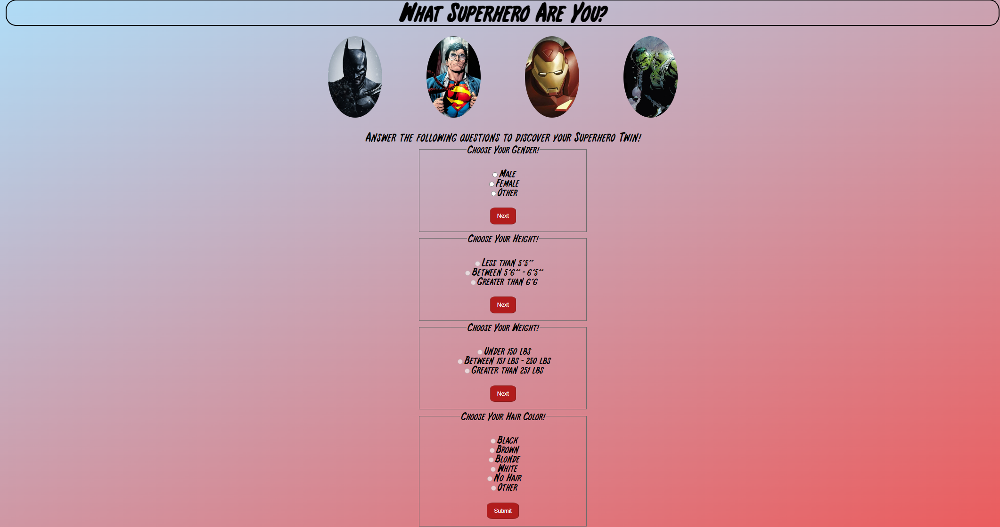

# Which Superhero Are You?

"Which Superhero Are You?" is a Single Page Application (SPA) that allows users to discover who their "Superhero Twin" is by answering a series of questions and clicking "submit" to display the details of the Superhero that matches them.

My small but mighty team (Lucas, Yifan, and I) completed this JavaScript project in less than a week and had a blast while challenging ourselves to integrate everything we've learned up to this point.

Technologies used: Our frontend was built with HTML, CSS, and JavaScript and communicates with a public API (https://akabab.github.io/superhero-api/api/)

## Goals
Our goal was to build an application and simulate a professional work environment:
-we first planned out your designs and features
-we pitched our project
-we used Github to collaborate

## Accomplishments
-our application fetches data from a public API with over 700 superhero's information
-we created a series of filters that allows users to select multiple features about themselves to more accurately narrow down a matching superhero
-we were also able to display the matching result using a lightbox feature (this was our stretch goal)

## Challenges/Future Improvements
-we intended to make only 1 question appear at a time for the user

## Installation

Fork and clone this repository onto your local environment. Open index.html on your default browser. 

## Contributing
Pull requests are welcome. For major changes, please open an issue first to discuss what you would like to change.

Creators
---
Connie Park [Github](https://github.com/conniedc1206)     [Linkedin](https://www.linkedin.com/in/conniepark2)

Yifan Wu

Lucas Sweeney
